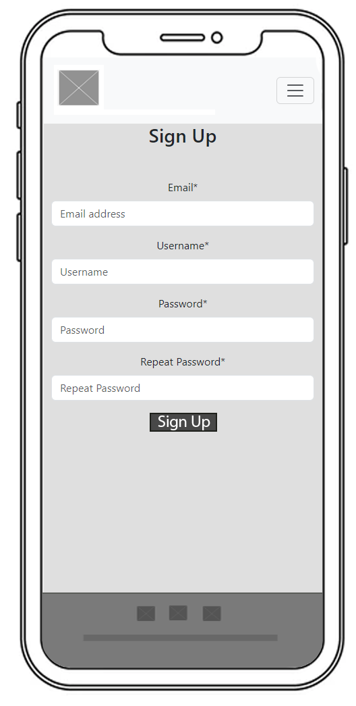
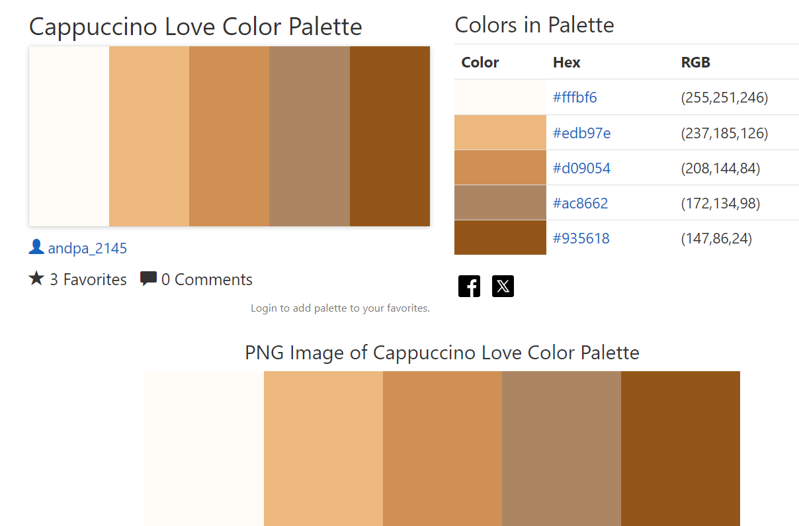
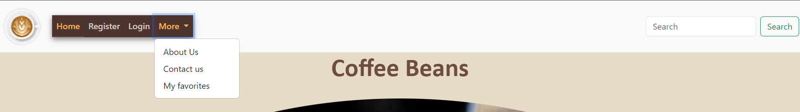
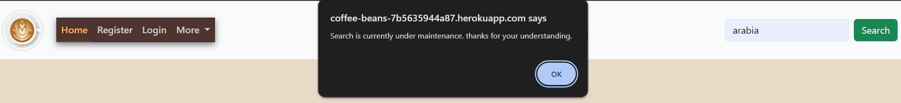
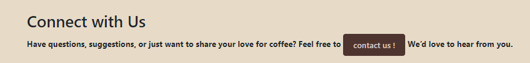

# Welcome to Coffee Beans Blog, Portfolio Project 4!

This blog is dedicated to exploring the world of coffee beans! 
From the rich flavors of Arabica to the bold notes of Robusta, we’ll cover everything about coffee bean varieties. 
Whether you're an enthusiast or just starting your coffee journey, this blog has something for everyone.

Visit the live site here: [Coffee Beans Blog](https://https://coffee-beans-7b5635944a87.herokuapp.com//)

[Github Repository](https://https://github.com/mufasa1611/Coffee_Beans-P4/)

## Table of Contents

1. [Design](#design)
2. [Agile](#agile)
3. [Features](#features)
4. [UX](#ux)
5. [Testing](#testing)
6. [Deployment](#deployment)
7. [Technologies](#technologies)
8. [Credits](#credits)

## Design

The Coffee Beans Blog was designed with coffee enthusiasts and casual readers in mind, offering a space for light and enjoyable content. 
The goal is to evoke a sense of warmth and relaxation through the use of inviting colors and easy-to-read fonts. 
The design remains clean and minimal, ensuring that users can easily focus on the content and navigate the site without distractions.

### Project planning

Coffee Beans wireframes:

Homepage:

Blog Post detail:

Register on Mobile:

Login on Mobile:

To plan the structure of the blog I made a flowchart with DrawSQL, which shows all functionality.  

### Font and Colour Choices
**Fonts:** Montserrat and Roboto fonts were chosen as they are simple and easy-to-read fonts, helping the user to focus on the content.

**Colors:** The Cappuccino color palette suitable for coffee beverages was chosen from [color-hex.com](https://color-hex.com). Some shades were adapted a little
for better contrast and readability.

 

**Images:** All images were taken from [pexels.com](https://www.pexels.com/) 

# Agile
I used the Projects tool within GitHub to manage the different processes needed for this project to be completed. At the beginning, a Project titled "Coffee_Beans_Board" was created on GitHub and linked to the Coffee beans blog repository. 
This Coffee beans Blog Project was used to keep track of the user stories and can be found here [here](https://github.com/users/mufasa1611/projects/9/).

In total, there were 16 user stories, of which 9 with the label "must have" were moved throughout the development cycle from "To Do" to "In Progress" to "Done". 
When I initially created the issues, I did not use any particular order to write down my ideas, so there are a number of issues that
became invalid or had to be modified when my project objectives changed over time. A few became obsolete, which I deleted from the board. With my next project I plan to be more organized. I think Agile technology is a very valuable tool, that needs to be implemented and followed through to keep up with the project deadlines and to keep track
of the most important features that need to be implemented in a given time-frame.

Details about the individual user stories, their associated Acceptance Criteria, Tasks, Labels and Epics can be found under the respective links: 
[#1 USER STORY: Create user account, must have](https://github.com/mufasa1611/Coffee_Beans-P4/issues/1) 
[#2 USER STORY: Add search function, may have](https://github.com/mufasa1611/Coffee_Beans-P4/issues/2) 
[#3 USER STORY: Add comment function, must have](https://github.com/mufasa1611/Coffee_Beans-P4/issues/3) 
[#4 USER STORY: Paginated content, must have](https://github.com/mufasa1611/Coffee_Beans-P4/issues/4) 
#5 USER STORY: status: deleted  
#6 USER STORY: status: deleted 
[#7 USER STORY: Add contact function, must have](https://github.com/mufasa1611/Coffee_Beans-P4/issues/7) 
[#8 USER STORY: Share posts function, may have](https://github.com/mufasa1611/Coffee_Beans-P4/issues/8) 
[#9 USER STORY: Manage blog posts, must have](https://github.com/mufasa1611/Coffee_Beans-P4/issues/9) 
[#10 USER STORY: Manage Comments, must have](https://github.com/mufasa1611/Coffee_Beans-P4/issues/10) 
[#11 USER STORY: Add favorites function, must have](https://github.com/mufasa1611/Coffee_Beans-P4/issues/11) 
[#12 USER STORY: Blog entries by users, may have](https://github.com/mufasa1611/Coffee_Beans-P4/issues/12) 
[#13 USER STORY: Blog Posts detailed page, must have](https://github.com/mufasa1611/Coffee_Beans-P4/issues/13) 
#14 USER STORY: status: deleted 
#15 USER STORY: status: deleted 
[#16 USER STORY: About me page, could have](https://github.com/mufasa1611/Coffee_Beans-P4/issues/16) 

## Features
The below section describes the site's features in detail.

- **Header**
    - The header is always visible on all pages of the blog. The coffee logo on the left is a link to the home page.
    - Signed out users see the navigation elements "Home", "Register", "Login" and a drop-down box named "More" containing links to "About us", "Contact us" and "My favorites".  
    
    
   - A logged-in user sees navigation elements to "Home", "Logout" and "More" with the drop-down menu showing showing "About Us", "Contact Us" and "My favorites". 
     
   
- On the right side is a search field button. This feature is not working at the moment, so if a user tries to use the search function, a prompt appears saying "Search is currently under maintenance. thanks for your understanding." The prompt disappears whenthe button "ok" is clicked.

- In the mobile view, the logo is on the left side up and a drop-down menu shows on the right side. When clicked, it opens under the header, pushing down the content. It contains the links to
      "Home", "Register", "Login" and "More" with its own drop-down menu showing "About Us", "Contact Us" and "My favorites". The blog posts are
      stacked under each other in a column, the images and text resize automatically.  
      

- **Main section - Home page**
    - The main part of the landing page contains the title, a landing image, and a display of the six most recent blog posts beneath.
    - Each post is displayed with an image, the post's title, date and time of the post and the name of the author.
      
    - There is a "Next" button at the bottom of the landing page to view the next page and "Prev" and "Next" buttons on the bottom of the page, for the user to easily navigate back and forth between the pages. 
     
   
- **Register**
    - If a site visitor wants to enjoy extra functionality such as being able to comment or to favorite posts, the user needs to login or to sign up.
    - To sign up, the user is asked to choose a username, a password and an email address. In order to ensure password safety, guidelines are displayed. 
     

- **Sign in**
    - If a user already has an account, they can log in on the sign-in page. 
    - After successfully signing in, a message appears on the top of the page, confirming that that the user is successfully signed in.
    - Should a user not yet have an account, they are provided with a link to the signup page. 
     

- **Post detail - Top of the page**
    - Upon clicking on any post title, a new page opens up.
    - The post title and date and time of publishing are displayed at the top next to the post's image.
   
    - In the mobile view, the favorites button and the drop-down menu are responsive and visible.. 
     
     

- **Favorites**
    - Beside each blog title, a heart-shaped grey colored button is displayed. If the mouse hovers over it, the button reads "Add to Favorites". Upon clicking it, the post is added to the user's favorites and the icon is displayed in red color.
     

    - If a post is already part of a user's favorites, the button reads "Remove from Favorites".  Upon clicking it, the post is removed from the user's favorites list and the icon turns grey again.
           
    - Upon clicking on "My Favorites" in the navbar drop-down menu, a new page opens up showing all the posts in the logged-in users favorites  
    
       
    
     - If a user is not logged in and clicks on the "Add to Favorites" button, they are prompted with the message "log in to favorite this post" and redirected to the Sign In page, indicating that a user needs to be logged in to use the Favorites function. 

- **Post detail - Comment section with CRUD**
    
    - At the bottom of the blog post, a small comments counter icon shows the total number of comments for this post.

    - Beneath, in the comments  section, the logged out user can read comments made by other users but cannot comment themselves. A prompt informs them to log in if they wish to comment.
    

    - The logged-in user can also read comments, and in addition can submit comments and edit or delete their own:
      - CREATE: A logged-in user can leave a comment by writing their text and clicking on the Submit button. The comment is then immediately published pending the admins approval.
      

      - READ: Any user can read their and other users' comments. Should the admin decide to not approve a comment, only the the user who submitted the comment, can see it. The comment is not visible to any other users.           
    
      - UPDATE: The user who wrote a comment can edit their comment - regardless of whether it is in an approved state or not.
        
      - DELETE: The user who wrote a comment can choose to delete it. The user is prompted to confirm if they intend to delete a comment. 
       

- **About Us Page**

    - Upon clicking on "About us" in the "More" dropdown-box, a page opens showing the landing image on top and information about the blog and blog owners beneath.
    

    - At the bottom of the page the user is invited to "contact us !". The button links directly to the "Contact us" page. For better UX and contrast, the button changes its color when the mouse hovers over it.
    

- **Contact Us Page**

    - All users can click on "Contact Us" in the "More" dropdown-box or click on the "contact us !" button on the "About Us" page to open the "Contact us" page.

     - The page shows a contact form, where the user can leave his name, email address and a feedback message or inquiry.

       

     - If the user clicks on the "send" button, a message confirms that he successfully submitted his feedback.

        
    - The messages are being sent to the admin dashboard inbox, where the admin can manage the messages and reply.

- **Sign Out**
    - Upon clicking "Logout" in the navbar, the user is redirected to a sign out page.
    - On this page, the user is asked whether they really want to sign out, and to confirm his intention.
       
    - Upon confirming, the user is signed out and a feedback message is displayed to the user, informing them that their action was successful.
    
       

- **Footer**
    - The footer contains a copyright symbol and the name of the author.
    - There are Github, Facebook, Instagram, Messenger and Twitter (X) icons. The icons open in a new tab, making it easy for users to come back to the site.
    - The footer is consistent throughout the pages.
    

### Possible Future Features
   - a share posts function, so the user can share their favorite blogs with their contacts on social media
   - logged-in users could publish their own blog posts so they can interact and exchange views with the online community
   - the site owners should be able to mark their blog posts with different categories, which would enhance UX for the users
   - add a search function, so the user can search by category, species and/or origin to find posts that interest them faster
   - 404 and 500 Error Page: Enhance UX by customizing the 404 and 500 error page to provide meaningful feedback on what went wrong.
   
### UX

### Site Goals

**As a site visitor:**

- As a site user I can register an account so that I can benefit from additional functionality such as commenting.
- As a site user I can view a paginated list of posts so that I have a good overview and can choose which post to view in detail.
- As a site user I can view a post in full so that I can read its contents and comments.
- As a site user, I can easily contact the admins or leave my feedback or inquiry via the "Contact us" page and form.
- As a logged-in site user I can comment on posts so that I can share my view on a given blog post.
- As a logged-in site user I can edit and delete my comments.
- As a logged-in site user I can favorite individual posts so that I can find them again easily.

**As the site administrator:**

- As a site admin I can create, read, update and delete posts so that I can manage the blog content.
- As a site admin I can un-approve comments by keeping them pending, so that quality and appropriate content on the blog is ensured.
- As a site admin I can read and send messages to interact with the users.

## Testing
A comprehensive report on testing and de-bugging for this project can be found [here](testing.md).

## Deployment

The repository was created on GitHub.

The code was edited locally on visual basic studio and then pushed to GitHub using the sequence: 
"git add ." --> "git commit -m "..."" --> "git push"

This site was then deployed on Heroku:
- In Heroku, on my dashboard, I clicked "New" and then "Create new app"
- I named the app, set the region to "Europe" and then clicked "Create app".
- In the "Settings tab", I added the necessary Config Vars "CLOUDINARY_URL", "DATABASE_URL", and "SECRET_KEY" with their respective values, and clicked "Add"
- In the deploy tab, I selected "GitHub" as deployment method, searched for my project, and connected the app to it.
- I deployed the site by choosing "Manual deploy."

## Technologies

- Main programming languages: Python, HTML, CSS, and JavaScript
- Django==5.0.4
- Gunicorn==21.2.0
- PostgreSQL / [ElephantSQL](https://elephantsql.com)
- [DrawSQL](https://drawsql.app/) for the flowchart
- Django-summernote==0.8.20.0
- Bootstrap 5.3
- Adobe Photoshop for the wireframes
- Whitenoise==6.6.0
- Django allauth==0.61.1
- Django crispy-forms==2.1
- Crispy-bootstrap5==2024.2
- Cloudinary==1.36.0
- dj3-cloudinary-storage==0.0.6
- [Favicon.io](https://favicon.io/favicon-generator/)
- [Image Resizer](https://imageresizer.com/)
- [Font Awesome](https://fontawesome.com//)
- [Google Fonts](https://fonts.google.com/)

 ## Deployment
I followed the steps written below to deploy my project to Heroku:
 + First created a Heroku account by following the instructions given from Code Institute.
 + "Create new App".
 + Give the App an unique name and enter region Europe.
 + Click on "Create App".
 + Go to Deploy section tab and scroll down to the Deployment Method. I connect to Github pages and then could search for my Github Repository "Coffee Beans" and then click connect.
 + Scroll down to Automatic and Manual Deploys sections. I clicked on Manual Deployment.
 + Deploy Branch.
 + After the project has been deployed successfully I clicked the View-button to see the program run in the terminal.

On Github:
The site was deployed to Git Hub pages using the following steps:
+ After logging into GitHub I  located the repository for Portfolio Project 4.
+ I then clicked the "Settings" button at the top of my repository
+ Under General, navigate to Code and Automation and select "Pages".
+ In the Build and Deployment section for Source, select 'Deploy from a branch' from the drop-down list.
+ For Branch, select "main" from the drop-down list and "/root" in the next bar and Save.
+ On the top of the page, the link to the complete website is provided.
+ The deployed site will update automatically upon new commits to the master branch.

  ## Credits
- User andpa_2145 for the "Cappucino Love Color Palette" made available on [color-hex.com](https://www.color-hex.com/color-palette/96887/)
- Images from [pexels.com](https://www.pexels.com/)
- [Gemini](https://gemini.google.com/) helped to write the blog content
- [Code Institute](https://codeinstitute.net/global/full-stack-software-development-diploma/?utm_term=code%20institute&utm_campaign=CI+-+AT+-+Search+-+Brand&utm_source=adwords&utm_medium=ppc&hsa_acc=8983321581&hsa_cam=18265909565&hsa_grp=142347245433&hsa_ad=646574752722&hsa_src=g&hsa_tgt=aud-1599270334980:kwd-319867646331&hsa_kw=code%20institute&hsa_mt=e&hsa_net=adwords&hsa_ver=3&gad_source=1&gclid=Cj0KCQiA2eKtBhDcARIsAEGTG43ORz1h13a2KLlWQpx9pKe36fyJK4x8Gq7OpjnnPzgt_NBkrarutvMaAnHkEALw_wcB) walkthrough project "I think therefore I blog" for the basic information
- [the Django Recipe Sharing Tutorial](https://www.youtube.com/watch?v=sBjbty691eI&list=PLXuTq6OsqZjbCSfiLNb2f1FOs8viArjWy&ab_channel=DeeMc) by Dee Mc, kindly referred by my facilitator [Kay Welfare](https://code-institute-room.slack.com/team/U056NU8DZEW)
- [The guide to the Github Agile Tool](https://www.youtube.com/watch?v=U_dMihBgUNY) by CI learnign content developer [Kasia Bogucka](https://code-institute-room.slack.com/team/U01UQRQAY3Y) 
- [the Djangoproject](https://docs.djangoproject.com/en/5.0/topics/testing/) a great source of information on automatet testing recommended by my mentor [Jack Wachira](https://code-institute-room.slack.com/team/U01GBLV8S9L)
- My group facilitator [Kay Welfare](https://code-institute-room.slack.com/team/U056NU8DZEW) for her ongoing support and help
- My Mentor [Jack Wachira](https://code-institute-room.slack.com/team/U01GBLV8S9L) for his input and valuable feedback
