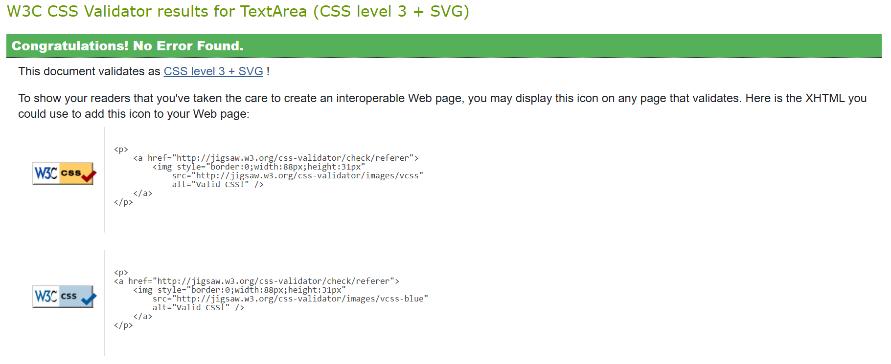

## Testing

- I confirmed that this project is responsive and looks good on different device screen sizes by using the devtools toolbar and manual testing.
-  I confirmed that signing up as a new user requires validation, ensuring usernames and passwords cannot be left empty.
- I checked that meaningful messages inform users of their login status, e.g. "You are signed in as [ user ]".
- I made sure only logged-in users can comment and add/remove posts to Favorites.
- I verified an additional confirmation step is required to prevent accidental logouts.
- I confirmed that header and footer are easily readable and consistent throughout the site.

### Fixed Bugs

- When implementing the comment functionality for the logged-in user, I decided to delete the Summernote features for security reasons. Also I deleted the option for the site admin to edit the comments of the logged-in users.
- When creating the Favorites color-toggle code, the toggle-function did not work until I fixed the "if" statement, which checks if the user has already favorited this post
- The "Home" link icon did not redirect to the dynamic homepage, but to the fixed URL
- The "contact us" form did not refresh after submitting a message to let the user know he successfully submitted his message.
- The buttons did not work properly until I applied bootstrap.

### Unfixed Bugs
- Heroko refused to connect to websites, that would render responsive mockups, e.g. https://amiresponsive.co.uk/ or https://ui.dev/amiresponsive

### Validator Testing

- HTML ([W3C Validator](https://validator.w3.org/))
    - **base.html and index.html:** 
     
    
    - Solution: after fixing the errors, all my html.pages showed: No errors
     
    
    - CSS ([Jigsaw](https://jigsaw.w3.org/css-validator/))
    No Error 

    - JS ([JS Hint](https://jshint.com/))
  only warnings, No Error
    
    - Python ([CI PEP8 Python Linter](https://pep8ci.herokuapp.com/))
      - **admin.py:** 
      - **apps.py:** 
      - **forms.py:** 
      - **models.py:** 
      - **urls.py:** 
      - **views.py:** 
        
      errors: Whitetrails and lines too long were fixed and resulted in:
        
       **No Errors** 

   - Performance, Accessibility, Best Practices, SEO (Lighthouse Chrome Dev Tools)
    - Lighthouse for desktop: 
     
    
    - Lighthouse for mobile: 
     

### Browser Testing 

**Layout:** Tested layout and appearance of site on several browsers.

**Functionality:** I ensured all links, navigation, buttons and form submit functions work as expected on different browsers.

| Browser     | Layout      | Functionality |
| :---------: | :----------:| :-----------: |
| Chrome      | ✔          | ✔             |
| Edge        | ✔          | ✔             |
| Firefox     | ✔          | ✔             |

### Automated Testing

 - I implented an automated test in test.views.py to ensure the blog's views function correctly. 
    - The "PostListViewTest" makes sure the homepage shows posts correctly by checking the right page is loaded, using the correct template, and showing the post content. 
    - The "PostDetailViewTest" checks the post detail page to ensure it loads properly, uses the right template, and shows the post’s title. 

 - Also an automated test in test.forms.py was implented for to ensure the comment form works as expected.
 
     - The "TestCommentForm" has two main tests:
       - "test_comment" checks that the form is invalid when the comment is empty.
   
       - The "test_comment_Valid": Ensures the form is valid when a comment has content.

These tests help confirm that users can only submit comments with content, improving the form's functionality.

### Manual Testing 

| Feature     | Expect      | Action        | Result |
| :---------: | :----------:| :-----------: | :-----:|
| **Home icon link** | When clicked, the user is taken back to the home page | Clicked on Home icon  | Return to home page |
| **Register link**  | When clicked, a new page opens where the user can sign up  | Clicked on Register | Sign Up page appears |
| **Sign Up button** | When filling in required sign-up details and clicking "Sign Up", an account is created  | Filled in required data and clicked on "Sign Up" | New user is created |
| **Login link** | When entering user details of registered user and clicking "Sign In", the user is signed in | Entered username and password, and clicked "Sign In" | User is signed in |
| **Meaningful feedback messages** | Upon every action, such as signing in or out, a feedback message is displayed to the user. | Signed in | feedback message about successful login opens |
| **blog posts Navigation** | When clicking on a NEXT or PREV button on the home page, the next or previous page of blog posts appears | Clicked on the NEXT and PREV buttons |Next/Previous three blog posts appear |
|**Opening blog posts**| When clicking on a title, a blog post opens in full | Clicked on a blog post's title | Blog post opens in full |
|**Add to favorites**| Upon clicking on "Add to Favorites" a blog post is added to the logged-in user's favorites list | Clicked "Add to Favorites" | Favorites icon turns red, post is added to the favorites list |
| **Remove from favorites** | Upon clicking on "Remove from Favorites" a blog post is removed from the user's favorites | Clicked "Remove from Favorites" | Favorites icon turns grey, post is removed from favorites list|
| **Contact Us link** | Upon clicking "Contact Us" in the menu, or the "contact us" link on the "About us" page,the "Contact Us" page opens, showing the contact form | Clicked on the "Contact Us !" link on the "About Us" page and on "Contact Us" in the header menu | "Contact Us" page opens | 
| **Favorites link** | When clicked, a page of all the logged-in user's favorite posts appears | Clicked Favorites link | All posts marked as Favorite by the user appear |
| **Leave a comment - blank** | When clicking "Submit" in the contact form without entering a comment, a prompt tells the user that there was an error with his submission| Clicked "Submit" without entering any content in the Body field | Prompt gets displayed: "There was an error with your submission." |
| **Leave a comment** | When entering content into the Body field and clicking "Submit", the comment gets displayed, the comment count increases and a prompt appears | Clicked "Submit" after entering content in the Body field | comment count increases by one and Feedback message appears: "Comment submitted and awaiting for approval" |
| **Edit a comment** | When clicking "Edit" below one of the user's own comments, the comment gets displayed in the Body field, and can be edited; after editing and clicking "Update", the edited comment is displayed below the blog post | Clicked "Edit", edited the comment, and clicked "Update" | The edited comment is displayed below the blog post and a success message displays: "Comment updated successfully" |
| **Delete a comment** | When clicking "Delete" below one of the user's own comments, the comment gets deleted | Clicked "Delete" | A pop up is asking the user to confirm that they want to delete the comment; clicked "Delete"; success message displays: "Comment deleted!" |
| **Logout link** | Upon clicking, the user is logged out | Clicked the Logout link | A confirmation question is displayed to the user whether they really want to log out; upon clicking "Sign Out", a success message is displayed: "You have signed out." |
| **Github/Facebook/Instagram/Messages/Twitter(X) icons in footer** | Upon clicking, the respective social media site will open in a new tab | Clicked all the icons | The respective site opens in a new tab |

### Testing User Stories 

| Expectation                         | Result                          |
| :---------------------------------: | :------------------------------:|
| As a site user I can register an account so that I can benefit from additional functionality such as commenting. | As a visitor, I can see a Register link in the navbar which takes me to a registration site. Registration is easy and helpful feedback prompts are given. |
| As a site user I can view a paginated list of posts so that I have a good overview and can choose which post to view in detail. | As a visitor, I see six posts displayed on the home page.  By clicking on the title, I can read the full post and I can navigate to next or previous page easily |
| As a site user I can view a post in full so that I can read its contents. | As a visitor, upon clicking on a post title, I can read the post in full. |
| As a logged-in site user I can comment on posts so that I can share my view on a given blog post. | As a logged-in visitor, I can comment on the posts of my choice. I can also edit and delete my comments. |
| As a logged-in site user I can favorite posts so that I can find them again with ease. | As a logged in visitor, I can add posts to my favorites by clicking the heart button in the detailed post view. I can remove a post from my favorites the same way. Upon clicking on "My Favorites" in the navbar, I see a list of the posts I have favorited. |
| As a site admin I can create, read, update and delete posts so that I can manage the blog content. | As a site admin, I can create, read, update and delete posts from the admin panel by clicking on Posts. |
| As a site admin I can keep not appropiate comments un-approved so that quality and appropriate content on the blog is ensured. | As a site admin, I can keep select comments unapproved|

